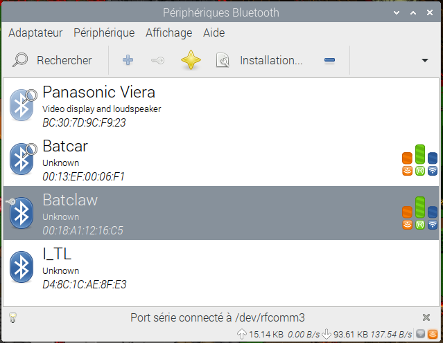

### Contrôle de robot avec 2 connexions Bluetooth sous Raspberry Pi.


Matériel : Raspberry Pi 4
Distribution : Raspberry OS
Clé Bluetooth : TP-Link Clé Bluetooth UB400

Code source : 


#### 1/ Installation des paquetages.

```
pi@raspberry:~ $ sudo apt-get install python-pip python-dev
pi@raspberry:~ $ sudo pip install evdev
pi@raspberry:~ $ sudo apt-get install python-bluez bluez-test-scripts bluetooth bluez blueman pi-bluetooth
pi@raspberry:~ $ sudo pip install pyserial
```


#### 2/ Redémarrage du service Bluetooth :

```
pi@raspberry:~ $ sudo service bluetooth restart
```


#### 3/ Vérification de la présence du Bluetooth interne.

```
pi@raspberry:~$ hciconfig
hci0:	Type: Primary  Bus: UART
	BD Address: DC:A6:32:22:CE:89  ACL MTU: 1021:8  SCO MTU: 64:1
	UP RUNNING PSCAN 
	RX bytes:2476 acl:0 sco:0 events:163 errors:0
	TX bytes:6365 acl:0 sco:0 commands:163 errors:0
```


#### 4/ Brancher la clé Bluetooth.

```
pi@raspberry:~ $ hciconfig
hci1:	Type: Primary  Bus: USB
	BD Address: 00:1A:7D:DA:71:15  ACL MTU: 310:10  SCO MTU: 64:8
	UP RUNNING 
	RX bytes:654 acl:0 sco:0 events:42 errors:0
	TX bytes:1445 acl:0 sco:0 commands:41 errors:0

hci0:	Type: Primary  Bus: UART
	BD Address: DC:A6:32:22:CE:89  ACL MTU: 1021:8  SCO MTU: 64:1
	UP RUNNING PSCAN 
	RX bytes:2476 acl:0 sco:0 events:163 errors:0
	TX bytes:6365 acl:0 sco:0 commands:163 errors:0
```


#### 5/ Allumer les périphériques Bluetooth du robot.


#### 6/ Lancer l'interface en ligne de commande du Bluetooth.

```
pi@raspberry:~$ sudo bluetoothctl
[NEW] Controller 00:1A:7D:DA:71:15 raspberry [default]
Agent registered
[bluetooth]# 
```


#### 7/ Détecter les périphériques Bluetooth du robot.

```
[bluetooth]# scan on
Failed to start discovery: org.bluez.Error.InProgress
[CHG] Device 00:18:A1:12:16:C5 RSSI: -67
[CHG] Device 00:18:A1:12:16:C5 RSSI: -56
[CHG] Device 00:18:A1:12:16:C5 RSSI: -64
[CHG] Device 00:18:A1:12:16:C5 RSSI: -56
[DEL] Device D4:8C:1C:AE:8F:E3 I_TL
[DEL] Device BC:30:7D:9C:F9:23 Panasonic Viera
[DEL] Device 00:18:A1:12:16:C5 Batclaw
[DEL] Device 00:13:EF:00:06:F1 Batcar
[NEW] Device D4:8C:1C:AE:8F:E3 I_TL
[NEW] Device 00:18:A1:12:16:C5 Batclaw
[NEW] Device 00:13:EF:00:06:F1 Batcar
[CHG] Device 00:18:A1:12:16:C5 RSSI: -70
[CHG] Device 00:18:A1:12:16:C5 RSSI: -61
[CHG] Device 00:13:EF:00:06:F1 RSSI: -74
[CHG] Device 00:18:A1:12:16:C5 RSSI: -77
[CHG] Device 00:18:A1:12:16:C5 RSSI: -56
[CHG] Device 00:18:A1:12:16:C5 RSSI: -80
```


#### 8/ Appairer le périphérique USB 'Batcar'.

```
[bluetooth]# pair 00:13:EF:00:06:F1
Attempting to pair with 00:13:EF:00:06:F1
[CHG] Device 00:13:EF:00:06:F1 Connected: yes
Request PIN code
[agent] Enter PIN code: 6666
[CHG] Device 00:13:EF:00:06:F1 UUIDs: 00001101-0000-1000-8000-00805f9b34fb
[CHG] Device 00:13:EF:00:06:F1 ServicesResolved: yes
[CHG] Device 00:13:EF:00:06:F1 Paired: yes
Pairing successful
[CHG] Device 00:13:EF:00:06:F1 ServicesResolved: no
[CHG] Device 00:13:EF:00:06:F1 Connected: no
[NEW] Device BC:30:7D:9C:F9:23 Panasonic Viera
```


#### 9/ Appairer le périphérique USB 'Batclaw'.

```
[bluetooth]# pair 00:18:A1:12:16:C5
Attempting to pair with 00:18:A1:12:16:C5
[CHG] Device 00:18:A1:12:16:C5 Connected: yes
Request PIN code
[agent] Enter PIN code: 6666
[CHG] Device 00:18:A1:12:16:C5 UUIDs: 00001101-0000-1000-8000-00805f9b34fb
[CHG] Device 00:18:A1:12:16:C5 ServicesResolved: yes
[CHG] Device 00:18:A1:12:16:C5 Paired: yes
Pairing successful
[CHG] Device 00:18:A1:12:16:C5 ServicesResolved: no
[CHG] Device 00:18:A1:12:16:C5 Connected: no
[CHG] Device 00:13:EF:00:06:F1 RSSI: -64
[CHG] Device 00:18:A1:12:16:C5 RSSI: -55
[CHG] Device 00:13:EF:00:06:F1 RSSI: -55
[NEW] Device 00:13:EF:00:06:F1 Batcar
[CHG] Device 00:13:EF:00:06:F1 Connected: yes
[DEL] Device 00:13:EF:00:06:F1 Batcar
[NEW] Device 00:18:A1:12:16:C5 Batclaw
[DEL] Device 00:18:A1:12:16:C5 Batclaw
[CHG] Device 00:18:A1:12:16:C5 Connected: yes
[CHG] Device BC:30:7D:9C:F9:23 RSSI: -84
[CHG] Device 00:13:EF:00:06:F1 Connected: no
[CHG] Device 00:18:A1:12:16:C5 Connected: no
[bluetooth]# 
```


#### 10/ Connecter les 2 périphériques Bluetooth via l'interface graphique 'Blueman-manager'.

- Cliquer sur l'icône "Blueman-manager" en haut à droite : 


- Sélectionner le périphérioque Bluetooth.
- Clique de droite.
- Sélectionner : Connection à Serial Port.
Le port série est alors déterminé et son numéro affiché.




#### 11/ Modification du code source des interfaces de télécommande.

- Remplacer le numéro du port série par celui trouvé dans 10/ dans le script Python de contrôle de la Batcar : 

```
~/ARDUINO/batcar_v6/CarRemoteControlInterface/runRemoteControlInterface.py 
```

A ligne : 
```
ser = serial.Serial('/dev/rfcomm2') 
```

- Remplacer le numéro du port série par celui trouvé dans 10/ dans le script Python de contrôle de la Batclaw : 

```
~/ARDUINO/batcar_v6/ClawRemoteControlInterface/runRemoteControlInterface.py 
```

A ligne : 
```
ser = serial.Serial('/dev/rfcomm2') 
```


#### 12/ Lancer les 2 interfaces graphiques de télécommande du robot.

- Télécommande de la Batcar : 

```
pi@raspberry:~$ cd ARDUINO/batcar_v6/CarRemoteControlInterface/
pi@raspberry:~/ARDUINO/batcar_v6/CarRemoteControlInterface$ ./runBatCar.py
```

- Télécommande de la Batclaw : 

```
pi@raspberry:~$ cd ARDUINO/batcar_v6/ClawRemoteControlInterface/
pi@raspberry:~/ARDUINO/batcar_v6/ClawRemoteControlInterface$ ./runBatCar.py
```


